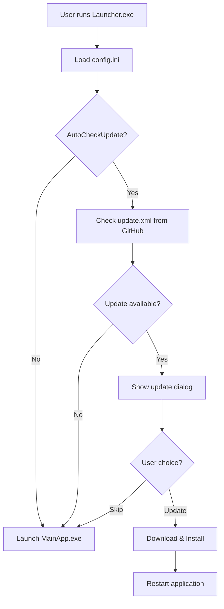

# Auto_Updater

A professional C# WPF auto-updater system with launcher architecture using AutoUpdater.NET and GitHub Releases.

## 🎯 Architecture

```
Auto_Updater/
├── Launcher.exe (152 KB)     # Lightweight updater launcher
│   ├── Reads config.ini
│   ├── Checks for updates
│   ├── Downloads & installs updates
│   └── Launches MainApp.exe
│
├── MainApp/
│   └── MainApp.exe (152 KB)  # Your actual application
│
├── config.ini                # Configuration file
└── update.xml                # Update manifest (hosted on GitHub)
```

## ✨ Features

- ✅ **Tiny Launcher** - Only 152 KB updater
- ✅ **Separated Concerns** - Updater separate from main app
- ✅ **INI Configuration** - Easy configuration without code changes
- ✅ **Auto-Update** - Automatic update checking
- ✅ **GitHub Integration** - Uses GitHub Releases for hosting
- ✅ **Checksum Validation** - SHA256 integrity verification
- ✅ **User Control** - Skip or remind later options
- ✅ **Modern UI** - Clean loading screen with animations

## 🚀 Quick Start

### Prerequisites

- **.NET 9 Runtime** (Windows Desktop Runtime)
  - Download: https://dotnet.microsoft.com/download/dotnet/9.0

### Installation

1. Download `Auto_Updater-v1.0.2.zip` from [Releases](https://github.com/lwsvincent/Auto_Updater/releases)
2. Extract to a folder
3. Run `Launcher.exe`

### First Run

1. Launcher loads `config.ini`
2. Checks for updates from GitHub
3. If update available, shows download dialog
4. After update (or skip), launches MainApp.exe

## ⚙️ Configuration

Edit `config.ini` to customize behavior:

```ini
[Updater]
# Update XML URL on GitHub
UpdateUrl=https://raw.githubusercontent.com/lwsvincent/Auto_Updater/master/update.xml

# Main application path (relative to launcher)
MainAppPath=MainApp\MainApp.exe

# Auto check for updates on startup
AutoCheckUpdate=true

# Show update UI dialog
ShowUpdateUI=true

# Force user to update (no skip button)
MandatoryUpdate=false

[Application]
AppName=Auto Updater Demo
Version=1.0.2
```

## 📦 For Developers

### Project Structure

```
Auto_Updater/
├── Launcher/              # Launcher project (updater)
│   ├── MainWindow.xaml    # Loading UI
│   └── MainWindow.xaml.cs # Update logic
│
├── MainApp/               # Main application project
│   ├── MainWindow.xaml    # App UI
│   └── MainWindow.xaml.cs # App logic
│
├── config.ini             # Runtime configuration
├── update.xml             # Update manifest
└── create-installer.ps1   # Build script
```

### Building

```bash
# Build Launcher (framework-dependent)
cd Launcher
dotnet publish -c Release -r win-x64 --no-self-contained

# Build MainApp (framework-dependent)
cd MainApp
dotnet publish -c Release -r win-x64 --no-self-contained

# Package for distribution
# Copy Launcher.exe, config.ini, and MainApp/ folder
```

### Creating a New Release

1. Update version in `MainApp/MainApp.csproj`
2. Build both projects
3. Create ZIP package
4. Calculate SHA256: `Get-FileHash package.zip -Algorithm SHA256`
5. Update `update.xml` with new version and checksum
6. Create GitHub release and upload ZIP
7. Commit and push `update.xml` changes

### Update Manifest (update.xml)

```xml
<?xml version="1.0" encoding="UTF-8"?>
<item>
    <version>1.0.2.0</version>
    <url>https://github.com/USERNAME/REPO/releases/download/v1.0.2/package.zip</url>
    <changelog>https://github.com/USERNAME/REPO/releases/tag/v1.0.2</changelog>
    <mandatory>false</mandatory>
    <checksum algorithm="SHA256">HASH_HERE</checksum>
</item>
```

## 🔄 Update Flow



## 📊 Size Comparison

| Component | Size | Type |
|-----------|------|------|
| **Launcher.exe** | 152 KB | Framework-dependent |
| **MainApp.exe** | 152 KB | Framework-dependent |
| **Dependencies** | ~1.5 MB | Shared DLLs |
| **Total Package** | ~2 MB | Requires .NET Runtime |
| **Old v1.0.1** | 164 MB | Self-contained |
| **Reduction** | **99%** | **Much smaller!** |

## 🛠️ Tech Stack

- **Framework**: .NET 9 (WPF)
- **Auto-Update**: [AutoUpdater.NET](https://github.com/ravibpatel/AutoUpdater.NET) 1.9.2
- **Configuration**: [ini-parser](https://github.com/rickyah/ini-parser) 2.5.2
- **Hosting**: GitHub Releases
- **Language**: C#

## 🎨 Customization

### Change Launcher UI

Edit `Launcher/MainWindow.xaml` to customize the loading screen.

### Change Main App

Edit `MainApp/MainWindow.xaml` for your application UI and logic.

### Update URLs

Change URLs in `config.ini` - no code changes needed!

## 📝 Version History

### v1.0.2 (Latest)
- ✨ Refactored to launcher + main app architecture
- ✨ Added INI configuration system
- ✨ Reduced size from 164 MB to ~2 MB (99% reduction)
- ✨ Framework-dependent builds
- ✨ Modern loading UI with animations

### v1.0.1
- ✨ Enhanced UI with green version text
- 🔧 Updated assembly version

### v1.0.0
- 🎉 Initial release with AutoUpdater.NET
- 📦 Self-contained deployment (164 MB)

## 🤝 Contributing

This is a demo project showing auto-update architecture. Feel free to fork and customize for your needs!

## 📄 License

Free to use for commercial and personal projects.

## 🔗 Resources

- [AutoUpdater.NET Documentation](https://github.com/ravibpatel/AutoUpdater.NET)
- [GitHub Releases API](https://docs.github.com/en/rest/releases)
- [.NET 9 Download](https://dotnet.microsoft.com/download/dotnet/9.0)

## 💡 Tips

1. **For Private Repos**: Use GitHub PAT in AutoUpdater authentication
2. **For Large Apps**: Use delta updates with Squirrel.Windows
3. **For No-Runtime**: Switch to self-contained builds (larger size)
4. **For Installers**: Use Inno Setup or WiX for proper installers

---

**Repository**: https://github.com/lwsvincent/Auto_Updater

🤖 Generated with [Claude Code](https://claude.com/claude-code)
